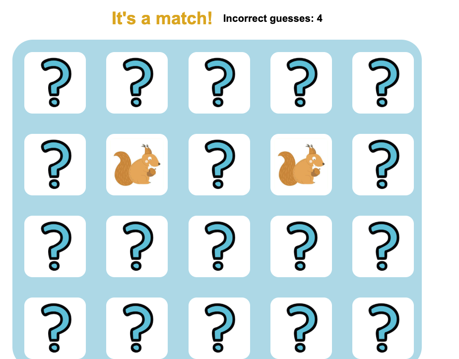
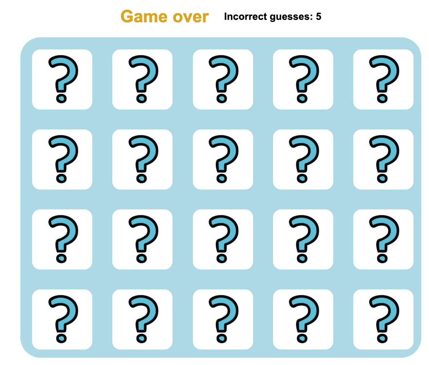
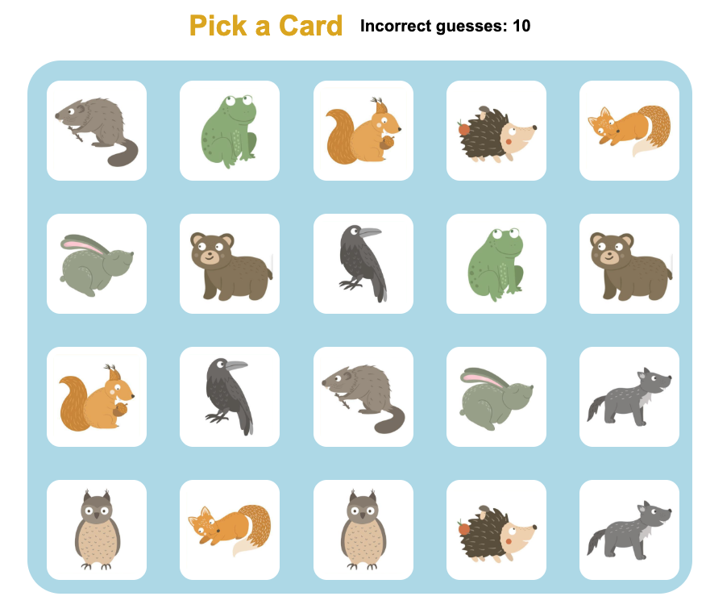

 # Concentration 
 The classic card memorising game - take turns to pick pairs of cards - if they match leave them up-turned - if they don't turn them back over and try again to find matching cards. Try getting all the matching pairs before 20 incorrect guesses.

## Screenshots
### Start up screen

### Match message

## Technologies Used 
* JavaScript
* HTML 
* CSS

☐ Getting Started: In this section include the link to your deployed game and any instructions you deem important.

☐ Next Steps: