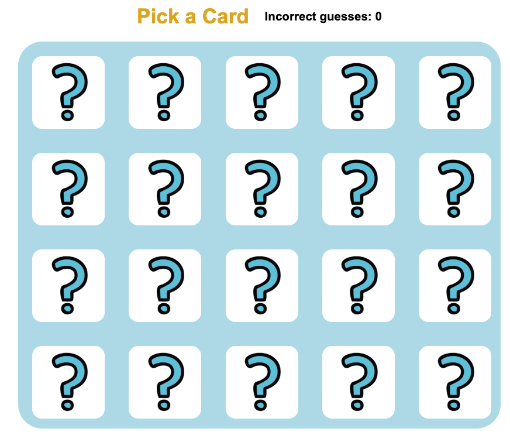

 # Concentration 
 The classic card memorising game - take turns to pick pairs of cards - if they match leave them up-turned - if they don't turn them back over and try again to find matching cards. Try getting all the matching pairs before 20 incorrect guesses.

## Screenshots
### Start up screen

### Match message

## Technologies Used 
* JavaScript
* HTML 
* CSS

## Getting Started 
[Deployed game](https://rrit5727.github.io/project1/)
* Click on a pair of cards and try and find a match!
* Try find all the matching pairs before 10 incorrect guesses
* Try find edge cases e.g. click on the same card twice, click on the board background and click offscreen.

## Next steps
* Add animations and sounds
* Insert graphic element to show match instead of simple text
* create mystery pair of invisible cards for automatic win

☐ Next Steps: